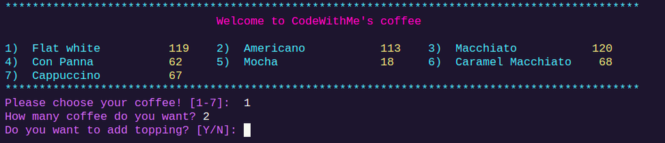
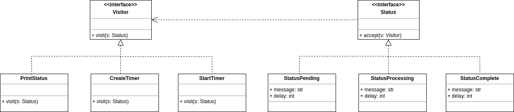
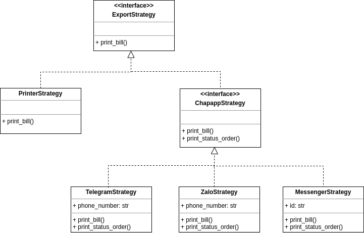
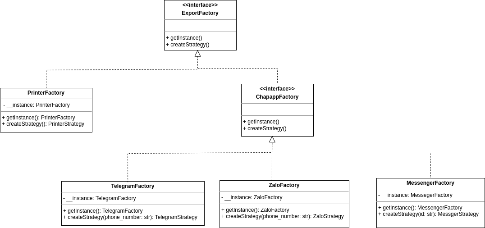
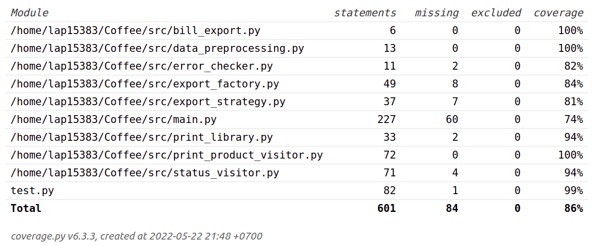

## Introduction
This is a simple `console app` for customer in order to use the Coffee System service (such as buy coffee with more topping, print bill, send order status,...) by Code with Me. This colorful console app written by `Python3` and run well on `Linux` OS. The system is designed with 2 mode. The first one is normal when the user (customer) can interact directly with program via the command line instruction and the second one is read the already file for testing. Due to the simple of this app, there is no `Database System` at all, the data just initializes manually and store in a json file. Hope you enjoy and have fun :).

## Usage
### Requirements
+ `Python` >= 3.8.10
+ `Pip` >= 20.0.2

### Install dependencies
``` sh
pip install -r requirements.txt
```

### Run program
``` sh
cd src
python3 main.py
```

### Testing
``` sh
cd test
coverage run -m unittest test
coverage report -m
coverage html
```

Watch `htmlcov/index.html`

## Design Pattern
In this assignment, I will try to integrate 4 Design Pattern in order to make my code easier to promote, make changes in the future and object reusability. They include **Singleton, Visitor, Factory, Strategy**. 
### Singleton

#### Introduction
`Singleton` is a **creational design** pattern that lets us ensure that a class has only one instance and it will be initialized only when it's requested for the first time, while providing a global access point to this instance.


#### How to implement?
+ Create an attribute which have **private static field** into the class for storing the *Singleton instance*.
+ Define a **public static creation method** for getting the *singleton instance*. Inside the method, if singleton instance is `NULL`, initialize with new instance and then we just return the instance.
+ Make the access modifier of method `Constructor` of this class is `private` so that other class cannot create object and just the creation static method in this class can.
+ The client code cannot invoke the contructor of this class and only get instance by call the static creation method. 


#### Application
At first, we see on structure and function of `Export Factory`, for example the class `PrinterFactory`, we just only use this instace of class to indirectly generate the `PrinterStrategy` and doesn't have any responsibilities for stroing some special attributes for each instance, so that we need only create one instance in its lifecycle. This is the big chance we can apply the **Singleton Design Pattern** to this class. In addition, we can do the same with other classes `TelegramFactory`, `MessenerFactory`,...

```Python
class PrinterFactory(ExportFactory):
    __instance = None

    # Singleton
    @staticmethod
    def getInstance():
        if PrinterFactory.__instance == None:
            PrinterFactory.__instance = PrinterFactory()
        return PrinterFactory.__instance
    
    def createStrategy(self):
        return PrinterStrategy()
```


### Visitor
#### Introduction
Visitor is a behavioral design pattern that lets you separate algorithms from the objects on which they operate.

To be more specific, we can take an example about Expression, at first we have some classes BinOp(op: str, e1: Exp, e2: Exp), UnOp(op: str, e: Exp), IntLit(x: int), FloatLit(x: Float) and an abstract class Exp is the supper class of all these classes. Now, the problem want us to calculate the result of the Expression. So that we need to go through each class and add a method named calc() to calculate the result in each classes. Next more complicated, the problem want us to have the PrintPrefix function, then we need to go through these classes again and add print_prefix method inside each class for printing the prefx of expression. 

In this example, after a new feature in the future we again need to go through each class and add new method. But the problem is we don't want to alter existing classes structure. We expect that the code was already in fixed and we didn’t want to risk breaking it because of a potential bug in our changes. So how to overcome this challenge?

The Visitor pattern suggests that we place the new behavior into a separate class called visitor, instead of trying to integrate it into existing classes. The original object that had to perform the behavior is now passed to one of the visitor’s methods as an argument, providing the method access to all necessary data contained within the object.

#### How to implement?
- Declare a visitor interface `Visitor` and a set of `visiting methods`, one per each concrete element class that exists in the program such as visitElementA, visitElementB,..
- Declare the element interface and add the abstract method `acceptance` to the base class of the hierachy. The parameter of this method should pass a `Visitor object`.
- New feature is the Concrete Visitors, and each method visiting method is implements as new feature of the Element concrete class and pass Elemet concrete object as argument.


#### Application
In sending status feature, we can apply the `Visitor` design pattern into it. At first, we have 3 creator classes which are 3 pharses of order's status including: **Pending, Processing, Complete**. We have a interface class of them is Status which is associate with Visitor and have a method accept() to apply Visitor. Now, we have 3 feature: **PrintStatus, CreateTimer, StartTimer**. We create 3 classes which is the subclass of **Visitor** corresponding with 3 features. In normal ways, in Visitor class we will have 3 sub-method visit in order to visit 3 Element of Status such as visitStatusPending,... But in this project, just a small-scale and some action will have the same behaviour with some elements, we can use combile all of them into one method and use `type(x)` is the sign that we can use conditional flow to handle each element.




### Strategy
#### Introduction
`Strategy` is a **behavioral design pattern** that lets you define a family of algorithms, put each of them into a separate class, and make their objects interchangeable.

For example, we have an navigation app for travellers by car which user can enter the address and see the fastest route to the destination display on map. On the next update, we need to add more feature finding route not only for car but also for walker, cyclists, other public transport. So each time we add more algorithms, the main class of navigator doubled in size and it's hard to maintain and risk of potential bug.

To overcome this problem, `Strategy` design pattern can help us to extract all of these algorithms into seperate classes called `strategies`. The original class, called `context`, must have a field for storing a reference to one of the strategies and the client will pass the desired strategy to the context. The context works with all strategies through the same generic interface. And now the context become independent of concrete strategies, we can add new algorithm or modify the existing ones without changing the implementation of the context or other strategies.

#### How to implement?
- In the context class, identify an algorithm that’s prone to frequent changes. It may also be a massive conditional that selects and executes a variant of the same algorithm at runtime.
- Declare the strategy interface common to all variants of the algorithm, extract all algorithms into their own classes. We should implement the strategies interface.
- Client of context must choose suitable strategy that matches the way we expect the context to perform.
#### Application
In the export feature in order to print bill, we can apply **Strategy design pattern** into it. Since *print bill* function can print directly to `printer` or send bill to chatapp including `Telegram, Zalo, Messenger`. In the future, we expect to upgrade more functionality (for example: not only print to console, but also call Telegram API and send to real customer's data) or add more features (for example: QR code, whatapps,...) still not affect and change the code-base of other classes. We can do the same logic with `print_status_order` method in ChatappStrategy.


### Factory method
#### Introduction
`Factory Method` is a **creational design pattern** that provides an interface for creating objects in a superclass, but allows subclasses to alter the type of objects that will be created.

For exmaple, when we have an app for logistics management. At first, our codes just control the **Road Logistic** and use Truck class. But after that, the system will upgrade and need to be add Ships transport for **Sea Logistic**. To overcome this chalenge, we need to replace the object construction calls by calling the special **factory method**. The Object is returned by a factory method are often refer to as *products*. 


#### How to implement?
- Make every products follow the same interface. The interface should declare methods that make sense in every product.
- Add empty factory method inside the creator class. The return type of this method is the Product interface. 
- Create a set of creator subclasses for each type of product listed in the factory method. Override the factory method in the subclasses and extract the appropriate bits of construction code from the base method.

#### Application
In export feature, we can add **Factory Design pattern** into it. Our aim to create a class that can create an object in a superclass and subclasses can return the ype of objects will be created. Now, we expect to return `Export Strategies` object but corressponding with each type of Factory, it will return the subclass Export Strategies that it want. Apart from it, we can take full advantages by using Export Strategies to be a product of this Factory Design pattern. 



## Flowchart
 


## Naming Convention
In computer programming, a naming covention is the set of rules for choosing the character sequence to be used for **identifiers** which denote **variables, types, functions**, and other **entities** in **source code** and **documentation.

The reasons why we need to use a naming convention include the following:
- To reduce the effort needed to read and understand source code.
- To enable code reviews to focus on issues more important than syntax and naming standards.
- To enable code quality review tools to focus their reporting mainly on significant issues other than syntax and style preferences.

In Python case, these are some recommendation about naming covention for this programming language:
- **Class names** need to write as `UpperCamelCase` and usually is compound noun (for example: Printer, CoffeePrinter)
- **Constants** need to write as `CAPITALIZED_WITH_UNDERSCORES`
- **Other names** need to write as `lowercase_separated_by_underscores`
- **Private attributes** need to write with the prefix is 1 or 2 underscores such as `__instance`, `_instance`,... Prefix with double underscores or more changes the behaviour in classes regarding to [Name mangling](https://en.wikipedia.org/wiki/Name_mangling#Python). Moreover, prefix and postfix with double underscores are indented as `Magic names` which fulfill special behaviour in Python object, *for example*, `__add__` can use by syntax **obj1.__add__(obj2)** or **obj1 + obj2**.
- Always use `self` for first argument to instance methods. While we always use `cls` for first argument to class methods.
- **Function/Variable/Package/Module** name should write as `snake-case`, all-lowercases, short.
- **Function** name should write `snake-case` or `mixedCase` and often start with a `verb`.
## Unittest
Due to this project was written by **Python3**, there are some library support for testing. In this pharse, I use library `unittest` and `coverage` to test and control the coverage of the test. At first, I will generate the other version for testing whole program by read file instead of interacting with command line.
I have to test about syntax of command (error such as: Invalid input, Out of bound,...) and Whole program by reading line by line commands check the final results including: remaining data, cart list, total_price. But, the disadvantages is not check partial each function. Finally, after testing and checking by library, the coverage of the whole code is up to **86%**. The remaining can not checking may be the code that run directly by customer's input and the lack of testcases I have generated.




## Future improvement
+ We can extend the instruction, such as enter `Q` to quit the program instantly, enter `H` for showing the instruction, enter `C` to show all the customer's cart up to now,...
+ Interact with real application, call API of Messenger, Telegram, Zalo to send order status when it complete.
+ Add the payment function, check and call API for thrid party or bank for paying the cart 
+ Data is can fetch/update from the Database Management System.


## References
+ https://refactoring.guru/design-patterns
+ https://peps.python.org/pep-0008/#function-and-variable-names
+ https://en.wikipedia.org/wiki/Naming_convention_(programming)
+ https://codelearn.io/sharing/lam-quen-voi-unittest-trong-python
+ https://semaphoreci.com/community/tutorials/getting-started-with-mocking-in-python